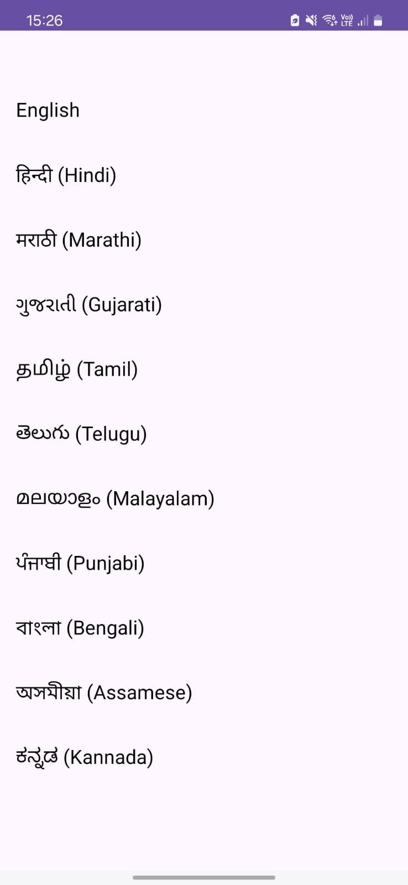
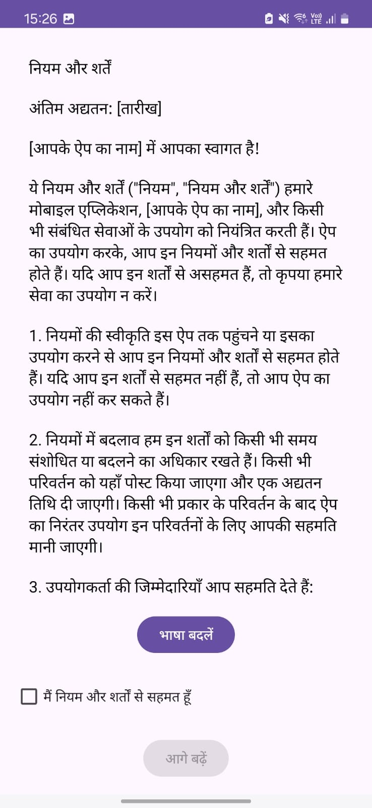
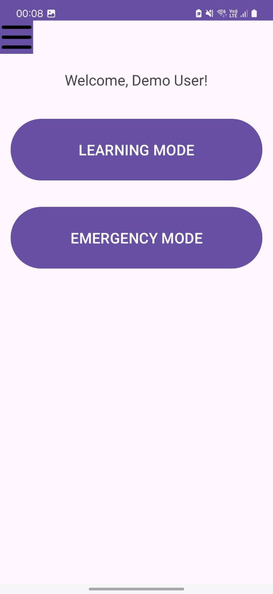
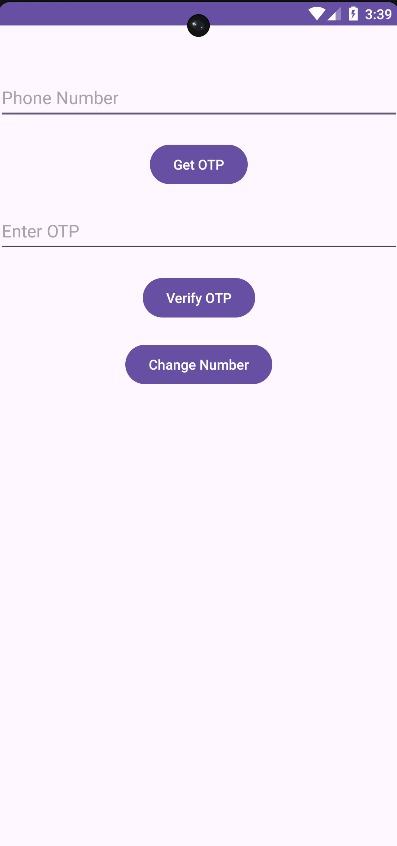

# 🇮🇳 LangLearnDemo

LangLearnDemo is a phonetic emergency sentence learning app designed to help users overcome language barriers in India by teaching them how to pronounce essential phrases correctly in regional languages.

---

## 🧭 Purpose

India has 22 official languages and hundreds of regional dialects.  
Travelers, migrants, and citizens in unfamiliar states may face life-threatening situations if they cannot communicate basic needs or distress.

This app addresses that by helping users speak and pronounce critical emergency sentences clearly — even if they don't understand the script.

---

## 📱 Demo Version Highlights

- 🔤 Select your known language: English  
- 🗣️ Learn how to speak Hindi, Marathi, or Kannada emergency phrases  
- 📖 View full-sentence phonetic translations for clear pronunciation  
- 📶 Works offline — lightweight and accessible  
- 🎯 Designed to integrate AI feedback and emergency detection in future versions  

> ⚠️ Note: This demo includes only 2 target languages and a **limited set of 7 emergency sentences** to prevent replication.  
> The full app currently supports **10 Indian languages** and includes **51 curated emergency sentences**, with more being added gradually.  
> The goal is to expand coverage to **all 22 official Indian languages** in future releases.


---

## 🖼️ Screenshots

### Demo App – Screenshot Walkthrough

### 1. Language Selection & Terms

Choose Your Known Language  


Terms & Conditions (Hindi Example)  


---

### 2. Home Page

Default Homepage View  



---

### 3. Login Flow

Login Page (English)  



---
### 4.  Language List


Which Language to Learn  


---

### 5. Sentence List

Sentence List (English Interface)  


---

### 6. Phonetic Learning

Word-by-Word Pronunciation (Marathi from English)  


---

👉 *To view all demo screenshots, visit the [`demo-app/`](assets/screenshots/demo-app/) folder.*

---

## 🎙️ Recording App – Screenshot Walkthrough

This private companion app is used to collect native speaker recordings securely and efficiently.  
While the APK and source code are not shared due to privacy concerns, these screenshots illustrate the complete data collection workflow.

---

### 1. Login 

**Login with Email**  


---

### 2. Sentence Display

**Sentence to be Spoken**  


---

### 3. Language Setup

**Choose Language**  


---
### 4. Recording

**Mic Popup for Recording**  


---

### 5. Upload to Firebase

**Choose Gender**  


**Send to Database**  


---

> ⚠️ *The recording app is used strictly for private data collection. Voice recordings are anonymized and stored securely in Firebase. This section is for transparency with reviewers and collaborators only.*


---

## 🔍 Project Structure

``` LangLearnDemo/ ├── app/ # Source code of the Android demo app │ └── demo/ # Android Studio project files │ ├── demo-apk/ │ └── app-debug.apk # Pre-built APK for direct testing │ ├── assets/ │ ├── demo-sentences.json # Sample JSON used in phonetic learning │ └── screenshots/ │ ├── demo-app/ # Demo app screenshots (UI walkthrough) │ └── recording-app/ # Recording app screenshots (private app) │ ├── ai-model/ # AI architecture, pipeline, and progress │ └── README.md │ ├── LICENSE # Open-source MIT license └── README.md # Main project documentation ``` 

---

## 🧠 AI Model (Training in Progress)

I am currently training the AI model using real voice recordings from native speakers across various Indian languages. The model is being developed to:

### 🎙️ Score Pronunciation Accuracy
- Analyze speech input using MFCCs, TensorFlow, and Librosa
- Compare user pronunciation to native recordings
- Score pronunciation in real time (≥75% required to progress)

### 🚨 Emergency Detection Mode
- Real-time voice input analysis
- NLP model flags distress or harmful phrases in multiple Indian languages
- Alerts the user and logs threat metadata

📂 Full pipeline documentation → [ai-model/README.md](./ai-model/README.md)

---

## 🔐 Privacy & Security

- Voice data is collected securely from trusted native speakers
- No identifying metadata is stored
- The recording app and dataset remain private to avoid misuse
- Demo app excludes full language set and AI logic for safety

---

## 📅 Roadmap

- [x] Phonetic breakdown UI for sentence learning
- [x] Language-linked JSON structure
- [x] Firebase-secured voice data pipeline
- [🟡] AI pronunciation model — **training ongoing**
- [ ] Emergency phrase detection integration
- [ ] Offline-first version with TTS + scoring

---

## 🤝 Collaborate With Me

If you're a native speaker of an underrepresented Indian language and would like to contribute **authentic pronunciation samples** or collaborate on the AI side, feel free to reach out:

📧 Email: **[yadav.akanksha03@gmail.com]**

---

## 📜 License

This project is licensed under the **MIT License**.  
You may use or modify this project **with attribution**. Redistribution of collected datasets or trained models is strictly prohibited.


