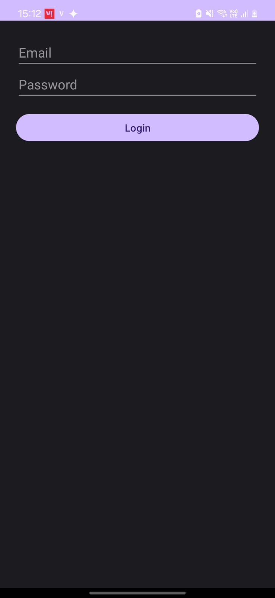
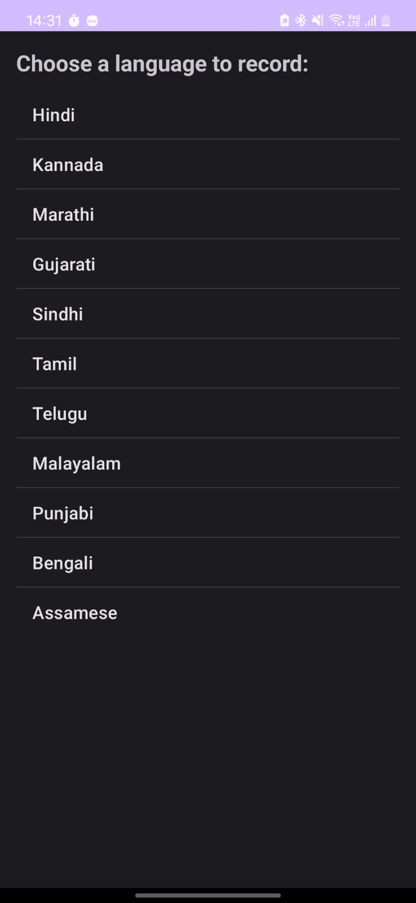
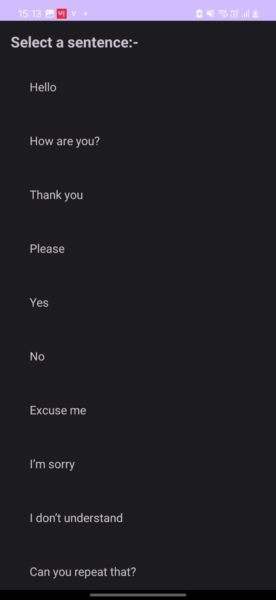
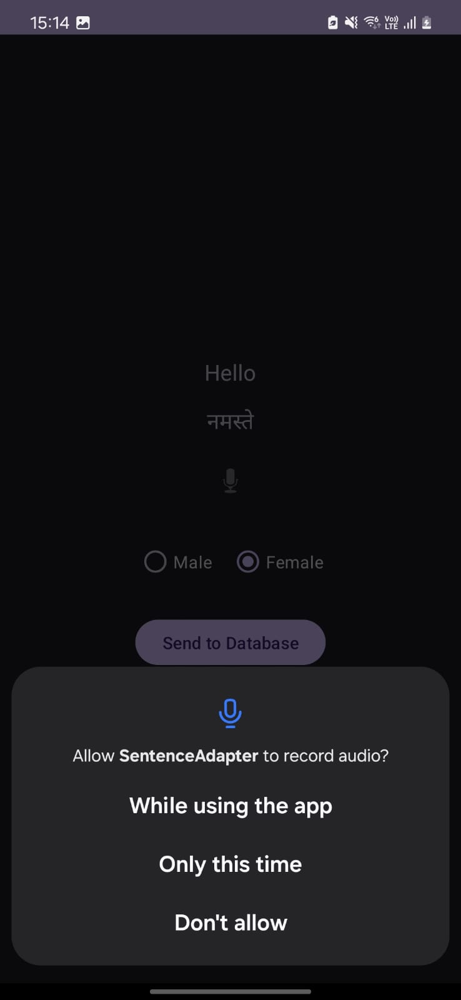
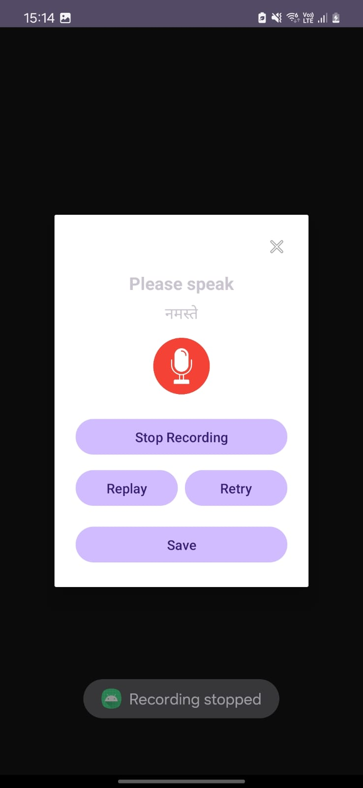

# 🇮🇳 LangLearnDemo

LangLearnDemo is a phonetic emergency sentence learning app designed to help users overcome language barriers in India by teaching them how to pronounce essential phrases correctly in regional languages.

---

## 🧭 Purpose

India has 22 official languages and hundreds of regional dialects.  
Travelers, migrants, and citizens in unfamiliar states may face life-threatening situations if they cannot communicate basic needs or distress.

This app addresses that by helping users speak and pronounce critical emergency sentences clearly — even if they don't understand the script.

---

## 📱 Demo Version Highlights

- 🔤 Select your known language: English
- 🗣️ Learn how to speak Hindi, Marathi, or Kannada emergency phrases
- 🧩 Sentences are split into word-by-word lessons for phonetic clarity
- 📶 Works offline — lightweight and accessible
- 🎯 Designed to integrate AI feedback and emergency detection in future versions

> ⚠️ Note: This demo includes only 2 target languages to protect against replication.  
> The full app currently supports 10 Indian languages, with plans to scale to all 22.

---

## 🖼️ Screenshots

## Demo App – Screenshot Walkthrough

### 1. Home Page

Default Homepage View

---

### 2. Language Selection & Terms

Choose Your Known Language

Terms & Conditions in Selected Language

---

### 3. Sentence List Page

Sentence List in Hindi

Sentence List in Marathi

---

### 4. Login / OTP Flow

Username Entry

OTP Verification

---

### 5. Menu & Navigation

Main Menu / Top Navigation

---

### 6. Phonetic Learning Flow

Word-by-Word Breakdown: Hindi

Word-by-Word Breakdown: Kannada

---

👉 *To view the full set of screenshots, browse the [`assets/screenshots/demo-app/`](assets/screenshots/demo-app/) folder.*

## 🎙️ Recording App – Screenshot Walkthrough

This companion app is used to collect native speaker recordings securely and efficiently.  
The APK is private for safety and privacy reasons, but here’s the full UI workflow:

---

### 1. Login & Language Setup

Login with Email

Choose Language

Choose Gender

---

### 2. Sentence Display

Sentence Display Before Recording

---

### 3. Recording Process

Microphone Permission Prompt

Recording Popup

---

### 4. Upload to Firebase

Send to Database

---

> ⚠️ *The recording app is not open-sourced due to privacy and security of voice data. These screenshots illustrate the complete process for reviewers and collaborators.*

---

## 🔍 Project Structure

---

## 🧠 AI Model (In Progress)

Future versions will include:

### 🎙️ Pronunciation Scoring
- Compares user recordings with native phoneme maps
- Uses MFCC, TensorFlow, librosa, and optional Wav2Vec2
- Scores pronunciation accuracy (target: ≥75%)

### 🚨 Emergency Detection Mode
- Real-time voice input
- NLP model flags distress or harmful phrases in 10+ Indian languages
- Alerts user if potential verbal threats are detected

For full pipeline details → [ai-model/README.md](./ai-model/README.md)

---

## 🔐 Privacy & Security

- Voice data is collected via a private recording app from trusted contributors
- No identifying metadata is stored
- AI model and dataset are not open-sourced yet to prevent misuse
- Demo excludes full language set and training logic intentionally

---

## 📅 Roadmap

- [x] Sentence breakdown UI
- [x] Multi-language JSON structure
- [x] Firebase-secured recording pipeline
- [ ] Train and validate AI pronunciation model
- [ ] Emergency phrase detection integration
- [ ] Offline-first version with TTS/STT feedback

---

## 🤝 Collaborate With Me

If you're a native speaker of any underrepresented Indian language and want to contribute voice samples securely, please reach out.

📧 Email: [your.email@example.com]

---

## 📜 License

This project is licensed under the MIT License.  
You may use or modify this project with attribution, but redistribution of proprietary datasets or trained models is prohibited.

