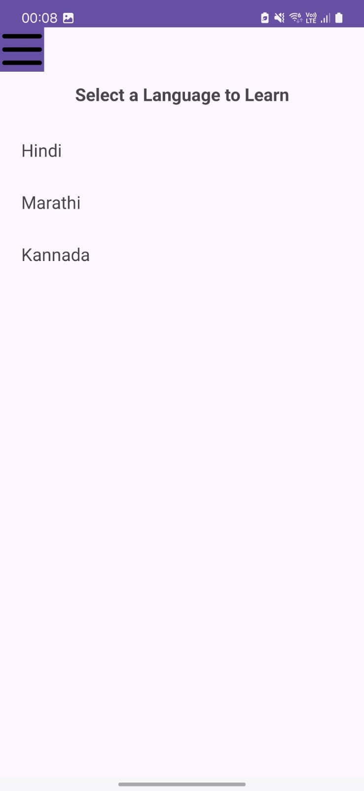
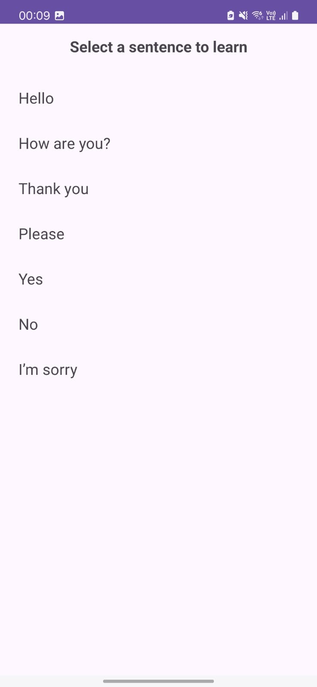
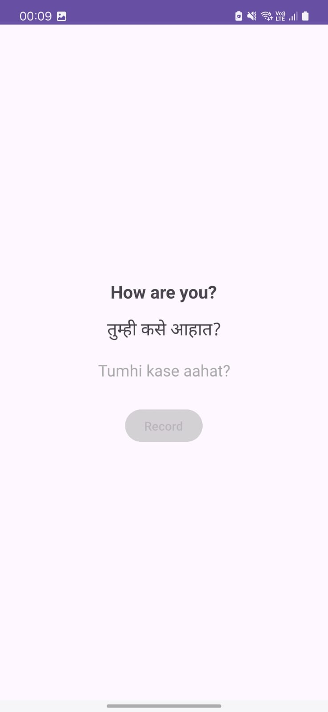
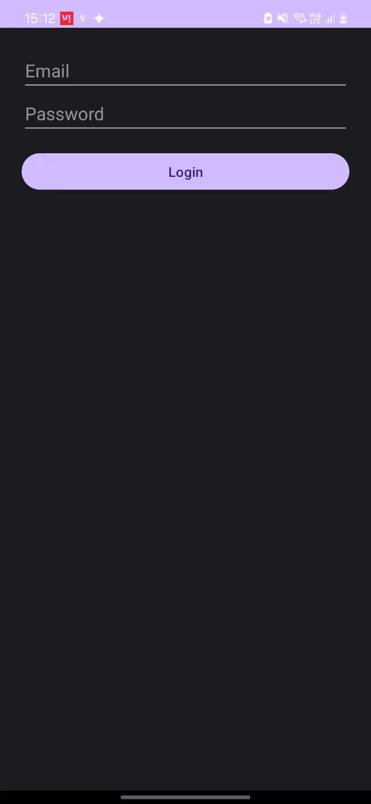
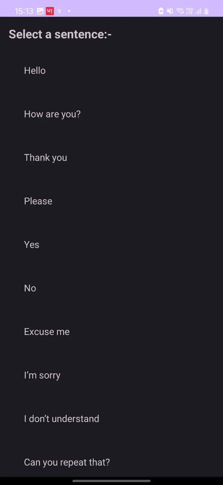
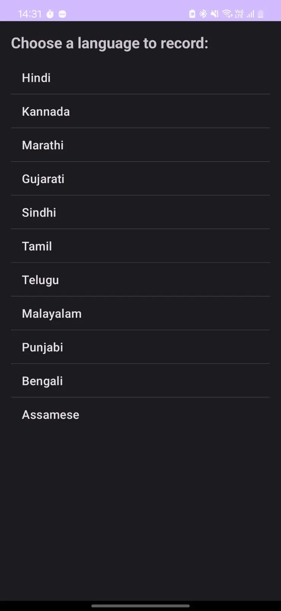
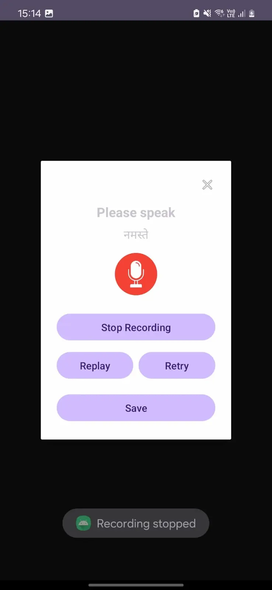
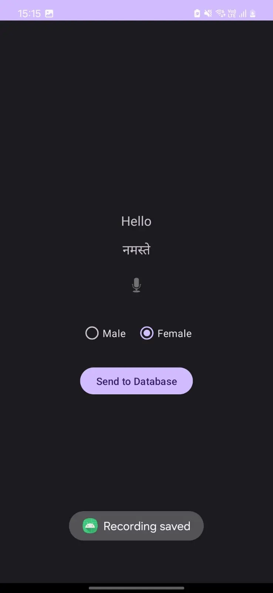
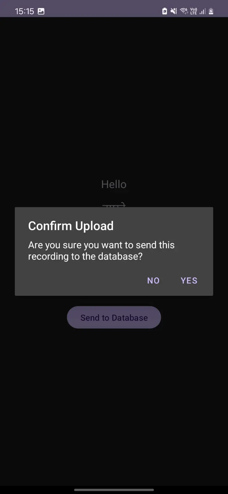

# 🇮🇳 LangLearnDemo

LangLearnDemo is a phonetic emergency sentence learning app designed to help users overcome language barriers in India by teaching them how to pronounce essential phrases correctly in regional languages.

---

## 🧭 Purpose

India has 22 official languages and hundreds of regional dialects.  
Travelers, migrants, and citizens in unfamiliar states may face life-threatening situations if they cannot communicate basic needs or distress.

This app addresses that by helping users speak and pronounce critical emergency sentences clearly — even if they don't understand the script.

---

## 📱 Demo Version Highlights

- 🔤 Select your known language: English  
- 🗣️ Learn how to speak Hindi, Marathi, or Kannada emergency phrases  
- 📖 View full-sentence phonetic translations for clear pronunciation  
- 📶 Works offline — lightweight and accessible  
- 🎯 Designed to integrate AI feedback and emergency detection in future versions  
- 🔐 Secured with phone number + OTP login (learning app) and email-authenticated upload (recording app)

> ⚠️ Note: This demo includes only 2 target languages and a **limited set of 7 emergency sentences** to prevent replication.  
> The full app(learning app) currently supports **10 Indian languages** and includes **51 curated emergency sentences**, with more being added gradually.  
> The goal is to expand coverage to **all 22 official Indian languages** in future releases.


---

## 🖼️ Screenshots

## 📸 Demo App – Screenshot Gallery

| Section | Screenshot |
|--------|------------|
| **Language Selection** <br> _Which language do you want to learn?_ |  |
| **Sentence List** <br> _English Interface_ |  |
| **Phonetic Learning** <br> _Word-by-word pronunciation (Marathi from English)_ |  |

👉 *To view all demo screenshots, visit the [`demo-app/`](assets/screenshots/demo-app/) folder.*

---

## 🎙️ Recording App – Screenshot Gallery

This private companion app is used to collect native speaker recordings securely and efficiently.  
While the APK and source code are not shared due to privacy concerns, the following screenshots illustrate the complete data collection workflow.

| Step | Screenshot |
|------|------------|
| **Login with Email** |  |
| **Sentence to be Spoken** |  |
| **Choose Language** |  |
| **Mic Popup for Recording** |  |
| **Choose Gender** |  |
| **Send to Firebase** |  |

> ⚠️ *The recording app is used strictly for private data collection. Voice recordings are anonymized and securely stored in Firebase. This section is included for transparency with reviewers and collaborators.*


---

<pre> 
## 🔍 Project Structure 
```
LangLearnDemo/ 
├── app/                  # Source code of the Android demo app 
│   └── demo/             # Android Studio project files 
│ 
├── demo-apk/ 
│   └── app-debug.apk     # Pre-built APK for direct testing 
│ 
├── assets/ 
│ 
├── demo-sentences.json   # Sample JSON used in phonetic learning 
│ └── screenshots/ 
│     ├── demo-app/       # Demo app screenshots (UI walkthrough) 
│     └── recording-app/  # Recording app screenshots (private app) 
│ 
├── ai-model/             # AI architecture, pipeline, and progress 
│   └── README.md 
│ 
├── LICENSE               # Open-source MIT license 
└── README.md             # Main project documentation 
```
</pre>


---

## 🧠 AI Model (Training in Progress)

I am currently collecting data and training a custom AI model using real voice recordings from native speakers of various Indian languages. This model powers two key features of the app:

---

### 🎙️ Pronunciation Scoring Engine (In Progress)
- Uses MFCCs, TensorFlow, and Librosa to analyze speech input
- Compares user pronunciation to validated native recordings
- Provides real-time feedback — users must reach ≥75% accuracy to progress
- Focused on **low-resource Indian languages** and **phonetic correctness**

---

### 🚨 Emergency Detection Mode (Early Stage)
- Analyzes real-time or uploaded audio
- Converts speech to text using custom STT models
- Flags distressing or dangerous phrases via NLP-based intent classification
- Alerts the user with on-screen phonetic guidance and optional Bluetooth voice prompt

📂 Full pipeline documentation → [ai-model/README.md](./ai-model/README.md)

---

## 🔐 Privacy & Security

- 🔐 The **recording app** uses **email/password Firebase Authentication** with device-based access control.  
  Only pre-approved user emails (stored in Firestore) are permitted to upload voice recordings.

- 📱 The **learning app** is secured using **Firebase Phone Authentication with OTP verification**, ensuring real-user access for mobile learning.

- 🔐 Both apps have strict Firebase rules to prevent unauthorized read/write access.  
  Even authenticated users can only access their permitted paths — all voice data is write-only and anonymized.

- 🚫 No personal identifiers (e.g., names, IPs, locations) are attached to recordings.

- 📂 Firebase credentials and storage buckets are kept secure and are **never exposed** in the public repo or APK.

> ✅ Security features were implemented to protect user data and ensure privacy in both apps, using Firebase’s authentication and access control tools.

---

## 📅 Roadmap

- [x] Phonetic breakdown UI for sentence learning
- [x] Language-linked JSON structure
- [x] Firebase-secured voice data pipeline
- [🟡] AI pronunciation model — **training ongoing**
- [ ] Emergency phrase detection integration
- [ ] Offline-first version with TTS + scoring

---

## 🤝 Collaborate With Me

If you're a native speaker of an underrepresented Indian language and would like to contribute **authentic pronunciation samples** or collaborate on the AI side, feel free to reach out:

📧 Email: **[yadav.akanksha03@gmail.com]**

---

## 📜 License

This project is licensed under the **MIT License**.  
You may use or modify this project **with attribution**. Redistribution of collected datasets or trained models is strictly prohibited.


